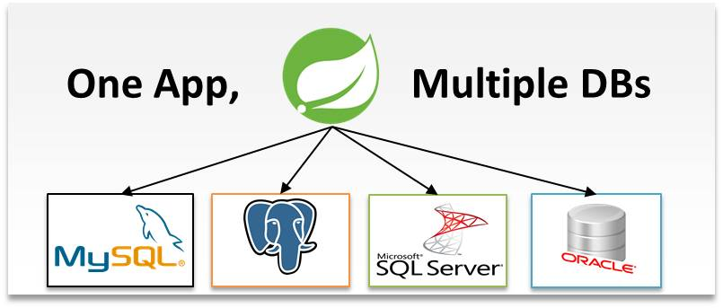

<h1> API de demonstração de multiplos bancos com Spring </h1>

Api desenvolvida com Spring boot

 
API REST integra duas bases de dados diferentes. API possui endpoint básico para incluir livro onde o campo nome do usuário do livro virá do banco Auth e 
O livro será persistido no banco App. São duas bases distintas do provedor MySQL. Pode-se incrementar outros provedores como Oracle ou PostgreSQL futuramente.

 

<h2>Tecnologias Aplicadas</h2>

Java 8

Apache Maven

Spring Boot

Spring Data JPA

Devtools

Lombok

Apache Tomcat Embarcado

Flyway

